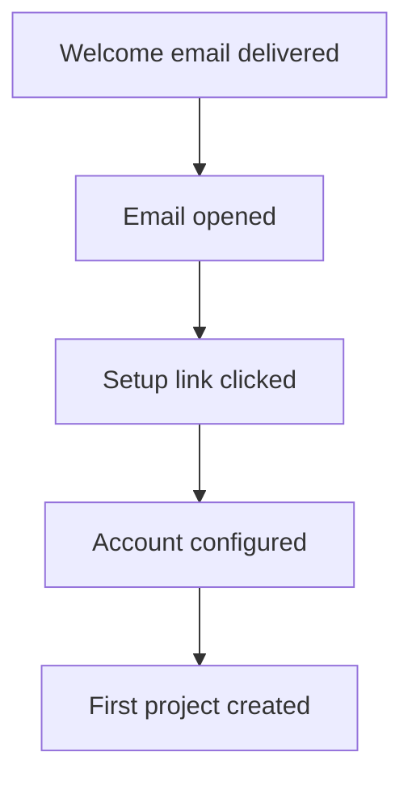

# Going further with email tracking

Now that you have email events flowing into PostHog, let's explore how to use this data for real-world campaigns and analytics.


# Why track email events in PostHog?

Before diving into implementation details, it's worth understanding what becomes possible when you connect email engagement data to your product analytics.

Tracking email events in PostHog lets you see the complete user journey, from email delivery through product activation. You can answer questions like: Did users who clicked your onboarding email activate faster? Which email campaigns drive the most feature adoption? How long between email click and product signup?

You can build funnels that span email and product (email delivered > opened > clicked > signed in > feature activated) to reveal drop-off points you couldn't see before. Maybe your email has a great open rate but poor clickthrough, or users click but don't convert.

Create cohorts based on email behavior. Engaged readers who opened 5+ emails in 30 days, link clickers who haven't signed up yet, or ghosts who never opened anything. Use these segments to personalize future campaigns, trigger in-app messages for engaged users, or stop sending to unengaged users to protect your deliverability.

Email engagement data can help you spot early warning signs of churn. Users who stopped opening emails, declining engagement patterns, and correlation between email behavior and retention. Use this information to trigger interventions before it's too late.


## Connect email events to specific users

The key to powerful email analytics is connecting email events to specific users. Always include user_id tags when sending emails from your application:
```javascript
// Good: Include user_id tag
await resend.emails.send({
  from: 'hello@yourapp.com',
  to: [user.email],
  subject: 'Welcome to our app!',
  html: emailTemplate,
  tags: {
    user_id: user.id  // Your internal user ID
  }
});

// Bad: No user_id tag
await resend.emails.send({
  from: 'hello@yourapp.com',
  to: [user.email],
  subject: 'Welcome to our app!',
  html: emailTemplate
  // Missing tags!
});
```

### Add campaign and context tags

Include additional tags for richer analytics:
```javascript
tags: {
  user_id: user.id,           // Required: User identifier
  campaign: 'onboarding',     // Campaign name
  email_type: 'transactional',// Type: transactional, marketing, notification
  template: 'welcome-v2',     // Template version for A/B testing
  cohort: user.signupMonth,   // User cohort
  ab_variant: 'control'       // A/B test variant
}
```

Then extend your Hog transformation to capture these tags:
```hog
// In your Hog code, after building base props
let props := {
    'email_id': request.body.data.email_id,
    'email_subject': request.body.data.subject,
    'email_from': request.body.data.from,
    'email_to': request.body.data.to[1]
}

// Add campaign tags as properties
if (tags) {
    if (tags.campaign) props['campaign'] := tags.campaign
    if (tags.email_type) props['email_type'] := tags.email_type
    if (tags.template) props['template'] := tags.template
    if (tags.ab_variant) props['ab_variant'] := tags.ab_variant
}
```

## Use case: Track onboarding email effectiveness

Understanding how your onboarding emails drive activation is one of the most valuable applications of email tracking.

### Build an onboarding funnel

Create a funnel that connects email engagement to product activation:

1. In PostHog, create a new **Funnel** insight
2. Add these steps:
   - Step 1: `email_delivered` (where `campaign = onboarding`)
   - Step 2: `email_opened`
   - Step 3: `email_link_clicked`
   - Step 4: `user_signed_in` (from your app)
   - Step 5: `feature_activated` (from your app)
3. Set time window (e.g., "within 7 days")
4. Group by `template` property to compare different onboarding emails

This shows you how email drives product activation, and where users drop off in the journey.

### Example onboarding flow


### Measure what matters

Key metrics to track:

- **Email-to-activation rate:** Percentage of users who activate after receiving onboarding emails
- **Time to activation:** How long from first email to activation
- **Drop-off points:** Where users abandon the onboarding flow
- **Template performance:** Which email variations drive the most activation

## Use case: Segment users by email engagement

Build user segments based on email behavior to personalize your communication strategy.

### Create engagement cohorts

In PostHog, go to **People > Cohorts > New cohort** and create segments like:

**Engaged email readers:**
```
User performed event: email_opened
At least 3 times
In the last 30 days

AND

User performed event: email_link_clicked
At least 1 time
In the last 30 days
```

**Email readers (no clickers):**
```
User performed event: email_opened
At least 1 time
In the last 30 days

AND

User performed event: email_link_clicked
Exactly 0 times
In the last 30 days
```

**Unengaged users:**
```
User performed event: email_delivered
At least 5 times
In the last 30 days

AND

User performed event: email_opened
Exactly 0 times
In the last 30 days
```

### Use cohorts to personalize email frequency

Once you've created cohorts, you can use them to adjust your email strategy. Create a feature flag in PostHog called `high-engagement-emails` and target it at your "Engaged email readers" cohort.

Then in your application:
```javascript
// Check if user is in high-engagement cohort via feature flag
const isEngaged = await posthog.isFeatureEnabled(
  'high-engagement-emails',
  user.id
);

if (isEngaged) {
  // Send weekly newsletter
  await sendWeeklyNewsletter(user);
} else {
  // Send monthly digest
  await sendMonthlyDigest(user);
}
```

This prevents email fatigue by automatically adjusting send frequency based on actual engagement patterns, rather than arbitrary schedules.

### Why this matters

Segmenting by engagement helps you:

- **Protect deliverability:** Stop sending to users who never open emails
- **Increase engagement:** Send more content to users who want it
- **Reduce unsubscribes:** Match frequency to user preferences
- **Improve targeting:** Focus high-value campaigns on engaged users

## Use case: Build re-engagement campaigns

Use email engagement data combined with product usage to identify and win back at-risk users.

### Find users who need re-engagement

Create a cohort in PostHog for users who are disengaging:

**At-risk users:**
```
User performed event: [your core product action]
Last seen: More than 30 days ago

AND

User property: subscription_status = active
```

### Check their email engagement

Before sending a re-engagement campaign, check if users are still reading your emails. In PostHog, create an additional cohort:

**At-risk but email-engaged:**
```
User in cohort: At-risk users (from above)

AND

User performed event: email_opened
At least 1 time
In the last 90 days
```

**At-risk and email-disengaged:**
```
User in cohort: At-risk users

AND

User performed event: email_opened
Exactly 0 times
In the last 90 days
```

### Send targeted campaigns

Export these cohorts and use them to customize your re-engagement approach:
```javascript
// For users still reading emails - send feature-focused campaign
async function sendFeatureReengagement(user) {
  await resend.emails.send({
    from: 'hello@yourapp.com',
    to: [user.email],
    subject: 'We miss you! Here\'s what\'s new',
    html: featureUpdatesTemplate,
    tags: {
      user_id: user.id,
      campaign: 'reengagement',
      segment: 'email_engaged'
    }
  });
}

// For users not reading emails - last attempt with strong offer
async function sendOfferReengagement(user) {
  await resend.emails.send({
    from: 'hello@yourapp.com',
    to: [user.email],
    subject: 'Special offer: 50% off your next 3 months',
    html: discountOfferTemplate,
    tags: {
      user_id: user.id,
      campaign: 'reengagement',
      segment: 'email_disengaged'
    }
  });
}
```

### Measure campaign effectiveness

Create a funnel to track re-engagement success:

1. Step 1: `email_delivered` (where `campaign = reengagement`)
2. Step 2: `email_opened`
3. Step 3: `email_link_clicked`
4. Step 4: `user_returned` (first app activity after 30+ days)

Compare conversion rates between your email-engaged and email-disengaged segments to see which approach works better.

## Create dashboards

Build PostHog dashboards to monitor email performance over time.

### Email performance dashboard

Create a dashboard with these insights:

**Overall email stats (last 30 days):**
- Total emails delivered (trend insight)
- Average open rate (formula: opens / delivered)
- Average click-through rate (formula: clicks / delivered)

**Campaign comparison:**
- Table showing metrics by campaign property
- Columns: Campaign name, Delivered count, Opens, Clicks, Open rate, CTR

**Top performing emails:**
- Bar chart showing emails with highest engagement
- Group by: `email_subject` property
- Metric: Click count

**Email engagement over time:**
- Line chart with daily counts
- Series: Delivered, Opened, Clicked

### User engagement timeline

For individual users, create a filtered view:

1. Go to **Activity > Events**
2. Filter to email events: `email_delivered`, `email_opened`, `email_link_clicked`
3. Filter by person
4. View their complete email interaction history

This helps you understand individual user engagement patterns when troubleshooting or analyzing specific cases.

## Next steps

You now have the foundation for building sophisticated email campaigns powered by PostHog analytics.

**Continue learning:**
- [Troubleshooting guide](./troubleshooting) - Fix common issues
- [PostHog documentation](https://posthog.com/docs) - Full PostHog features

**Share your use case:** What creative ways are you using email tracking? Let us know!