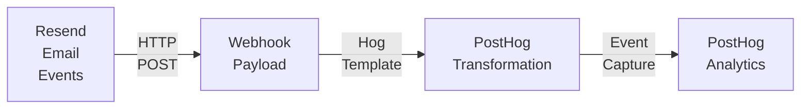

# How it works

This is a technical deep dive into using PostHog's incoming webhooks to ingest and transform events sent with Resend's webhooks.

## Architecture overview



## Data flow

The next sections explains each step in the process, from the email send to the event processing. 

### 1. Email event occurs

When an email is delivered, or someone interacts with it (opens it or clicks a link), Resend captures the event.

### 2. Resend sends webhook

Resend makes an HTTP POST request to your PostHog webhook URL with a payload like:

```json
{
  "type": "email.clicked",
  "created_at": "2025-11-11T14:23:45.123Z",
  "data": {
    "email_id": "abc123-def456-ghi789",
    "from": "hello@yourdomain.com",
    "to": ["user@example.com"],
    "subject": "Welcome to our app!",
    "tags": {
      "user_id": "user-uuid-123"
    },
    "click": {
      "link": "https://yoursite.com/page",
      "timestamp": "2025-11-11T14:23:45.123Z"
    }
  }
}
```

### 3. PostHog receives request

PostHog's incoming webhook endpoint receives the POST request and makes it available to your Hog transformation code via the `request` global object.

### 4. Hog transformation executes

Your Hog code transforms the payload:

```hog
// Map event type
let eventType := request.body.type  // "email.clicked"
let event := 'email_link_clicked'   // Transformed name

// Extract user idenity
let tags := request.body.data.tags
let distinctId := tags.user_id || request.body.data.to[1]
// Prefers user_id tag, falls back to email address

// Build properties
let props := {
    'email_id': request.body.data.email_id,
    'email_subject': request.body.data.subject,
    'clicked_link': request.body.data.click.link,
    // ... more properties
}

// Capture event
postHogCapture({
  'event': event,
  'distinct_id': distinctId,
  'properties': props,
  'timestamp': request.body.created_at
})
```

### 5. Event stored in PostHog

PostHog's capture system:

- Validates the event
- Associates it with the user (distinct_id)
- Stores it in the events database
- Makes it available for analysis

### 6. Appears in PostHog UI

After processing, the event becomes visible in PostHog. You can now see the event in user profiles, the activity feed, funnels and insights, and so on.

## Event mapping

This table describes how the events are mapped between PostHog and Resend

| Resend Event Type | PostHog Event Name | Properties |
|-------------------|-------------------|------------|
| `email.delivered` | `email_delivered` | email_id, subject, from, to |
| `email.opened` | `email_opened` | email_id, subject, from, to |
| `email.clicked` | `email_link_clicked` | email_id, subject, from, to, clicked_link, click_timestamp |
| `email.bounced` | `email_bounced` | email_id, subject, from, to, bounce_type |
| `email.complained` | `email_spam_complaint` | email_id, subject, from, to |


## Security considerations

All webhook traffic uses HTTPS with TLS 1.2+. The webhook URL is long, randomly generated, and acts as a bearer token. However, there's no cryptographic signature verification. If the URL is leaked, anyone can send events.

Keep webhook URLs private, don't commit them to public repositories, and rotate the URL if compromised by creating a new webhook. For production systems requiring strict security, consider implementing a custom webhook bridge with signature verification.

# Performance considerations

Events appear in PostHog 2-5 minutes after occurring. This includes webhook delivery (100-500ms), transformation execution (50-200ms), event capture (100-300ms), and UI processing (2-5 minutes).

PostHog incoming webhooks can handle thousands of requests per second with auto-scaling and no explicit rate limits. This is sufficient for most email use cases.

# Next steps

- [Try the tutorial](./tutorial) to set up the integration
- [Learn about extending it](./going-further) for advanced use cases