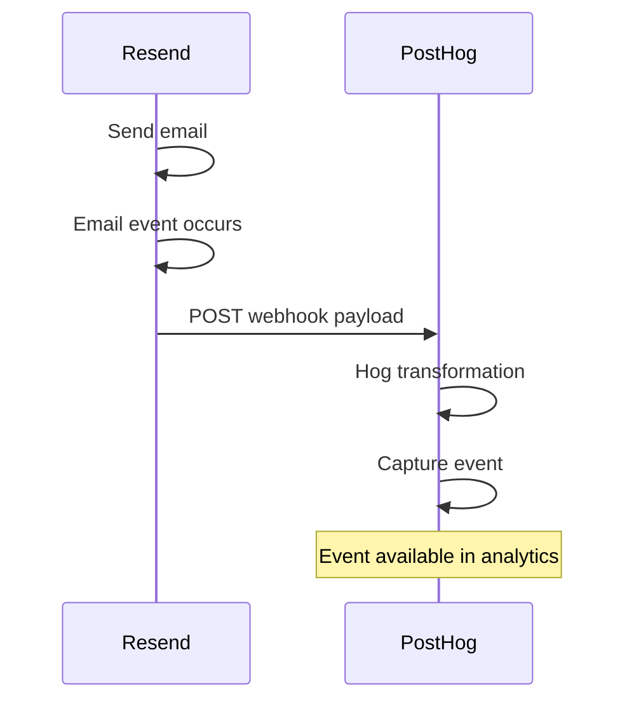

# Track email engagement in PostHog

Email can be a critical touchpoint in your user journey, but it's usually siloed from your product analytics. By bringing email engagement data into PostHog, you can:

- Understand the complete user journey
- Build smarter funnels
- Segment users by email engagement 
- Optimize email campaigns with A/B testing
- Measure email ROI
- Identify and prevent churn

Read more about these uses cases in [Do more](/docs/do-more.md).

## What you'll learn

This tutorial shows you how to use **PostHog's incoming webhooks** to receive email events directly from [Resend](https://resend.com/) and transform them into PostHog analytics events using [Hog](https://posthog.com/docs/hog).

We'll track these email-related events: 

- `email_delivered` - Email successfully delivered
- `email_opened` - User opened the email
- `email_link_clicked` - User clicked a link (includes which link)
- `email_bounced` - Email bounced (hard or soft)
- `email_spam_complaint` - User marked as spam

:::note

To track `email_opened` and `email_link_clicked`, you need a [verified domain in Resend](https://resend.com/docs/dashboard/domains/introduction) with **Open Tracking** and **Link Tracking** enabled.

:::

The process works like this: 

1. **Email event occurs** - User interacts with your email
2. **Resend sends webhook** - HTTP POST to your PostHog webhook URL
3. **Hog transforms data** - Maps Resend events to PostHog format
4. **Event captured** - Stored in PostHog for analysis

For a detailed technical explanation, see [How It Works](./how-it-works).

If you're more of a sequence diagram person: 

## What's next

Ready to get started? Head to the [Setup Tutorial](./tutorial) to begin tracking email events in PostHog.

Or, if you want to understand how it works first, check out [How It Works](./how-it-works).